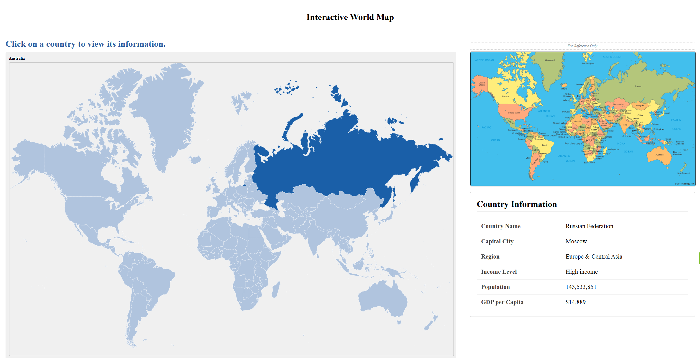

# World Map - Country Data Angular Project
This Angular application presents an interactive SVG world map that displays detailed country information upon selection. When a country is clicked and highlighted, the application connects to the World Bank API to retrieve and display the country's name, capital city, region, income level, population, and GDP per capita. The SVG world map and country data sections are both built as standalone Angular components and are loaded into the homepage component for display. There is only one page in the application, found at the /home URL. The application is compatible with both mouse and trackpad input.
### Project Configuration Details
- **Angular CLI:**  21.1.4
- **Node:**  24.13.0
- **Package Manager:**  npm 11.8.0
- **OS:**  win32 x64
- **Angular:**  21.1.4

## Security

A full vulnerability assessment for this application has been conducted using GitHub Advanced Security tools including Dependabot and CodeQL. The report and findings are documented in my DevSecOps portfolio repository.

[View Vulnerability Assessment Report](https://github.com/SBecraft/devsecops-portfolio/tree/main/angular-world-map-country-data)



### Methods

**`world-map.ts`**
- `ngOnInit()` — loads the SVG on startup
- `onMapClick()` — handles country click
- `onMapHover()` — handles mouse hover
- `onMapLeave()` — handles mouse leaving the map

**`homepage.ts`**
- `loadCountry()` — called when a country is clicked, fetches data from the World Bank API service

**`world-bank-api.service.ts`**
- `getCountryData()` — makes the 3 API calls for country name, capital city, region, income level, population, GDP, and returns the results
- `checkIfDone()` — counts when all 3 calls finish to display all data at once

**`country-data.ts`**
- No methods — it only has `@Input()` properties, it just receives and displays data

<br>
<br>


# Installation and Setup

### Prerequisites

#### Code Editor
A code editor is required to view and edit the project files. The recommended editor is **Visual Studio Code (VS Code)**:
```
https://code.visualstudio.com
```

#### Install Node.js and npm
Download and install Node.js from:
```
https://nodejs.org
```
npm is included automatically with the Node.js installation.

To verify the installation, run:
```bash
node -v
npm -v
```

#### Install Angular CLI
Run this command in your terminal:

```bash
npm install -g @angular/cli
```

### Clone the Repository

```bash
git clone https://github.com/SBecraft/angular-world-map-country-data.git
cd angular-world-map-country-data
```

### Install Project Dependencies
This project does not include the `node_modules` folder. Navigate to the project folder in your terminal and run:

```bash
npm install
```
This installs all required packages listed in `package.json`.

### Run the Application
Start the development server:

```bash
ng serve
```

Or automatically open it in your browser:

```bash
ng serve -o
```

Then open your browser and go to:

```
http://localhost:4200/home
```
The application will automatically reload if you change any of the source files.

 
